<h1 align=center>Three Tier assignment</h1>

## Goal:
The goal of this project is to create a [three-tier](https://docs.aws.amazon.com/whitepapers/latest/serverless-multi-tier-architectures-api-gateway-lambda/three-tier-architecture-overview.html) architecture application in an AWS VPC (Virtual Private Cloud) using cloudFormation. <br>

In the three-tier architecture, we have:
* **Data layer:** is the database where the data is stored.
* **Application layer:** This application layer is a [phpMyAdmin](https://www.phpmyadmin.net/) appication: it will manage the MySQL database hosted on AWS. 
* **Presentation layer:** Here, we have an NGINX application that act as a [reverse proxy](https://www.nginx.com/resources/glossary/reverse-proxy-server/) which helps the client access the backend.
* We will use **[bastion](https://aws.amazon.com/quickstart/architecture/linux-bastion/)** hosts to provide a secure access to the instances located in the private and public subnets of the VPC.

### NOTE: DELETE ALL THE RESOURCES AFTER YOU ARE DONE IN ORDER TO AVOID AN AWS BILL!!!

## Architecture:

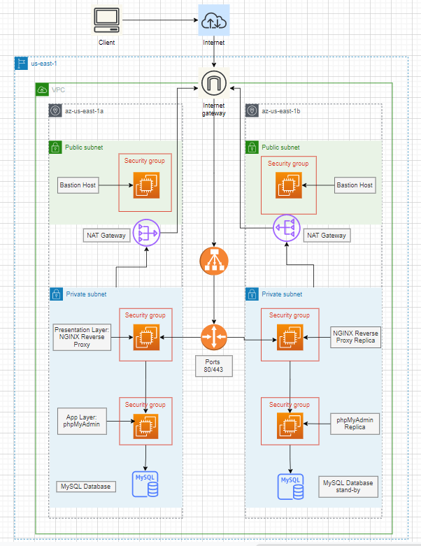

## Software Tools Used:
In this project, we used AWS services listed below.
* EC2
* Security Groups
* Internet Gateway
* Load Balancer
* Nat Gateway
* MySQL Database

## Precedure:

### Task 1

1. Create a VPC with a public subnet and private subnet using cloudFormation; here is the [yaml](https://docs.aws.amazon.com/codebuild/latest/userguide/cloudformation-vpc-template.html) file.<br>
Create **yaml** file named **[base.yaml](https://github.com/ibrahima1289/3_TIER_ASGMT/blob/main/base.yaml)**; copy the content of the [yaml](https://docs.aws.amazon.com/codebuild/latest/userguide/cloudformation-vpc-template.html) file and paste/modify it into the **[base.yaml](https://github.com/ibrahima1289/3_TIER_ASGMT/blob/main/base.yaml)** file.<br>

  * The **base.yaml** file template will deploy:
    * a VPC, with a pair of public and private subnets spread across two Availability Zones 
    * an internet gateway, with a default route on the public subnets
    * a pair of NAT gateways (one in each AZ), and default routes for them in the private subnets
    
2. Now, save the **base.yaml** file locally.
3. Create a stack on cloudFormation.
```
CloudFormation -> Stacks -> Create stack
```
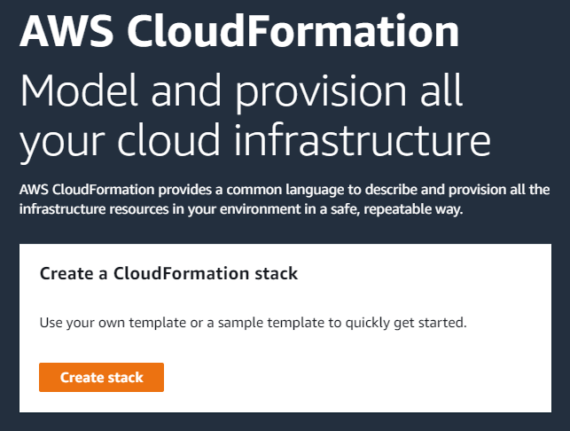

4. Upload the **base.yaml** file.

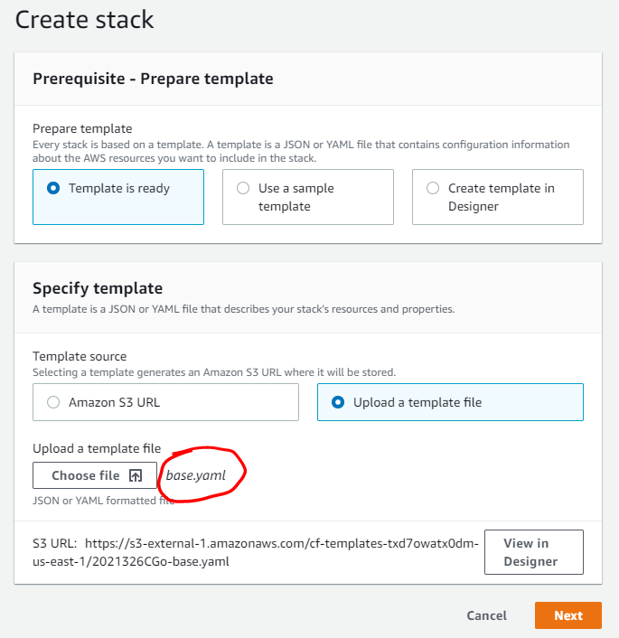

5. In the next page, give the stack a name

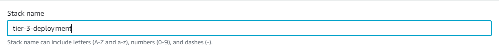

6. We can see the parameters are the same as in the **base.yaml** file.
7. Select the **key pair** that will allow you to **ssh** into the differents **EC2**.

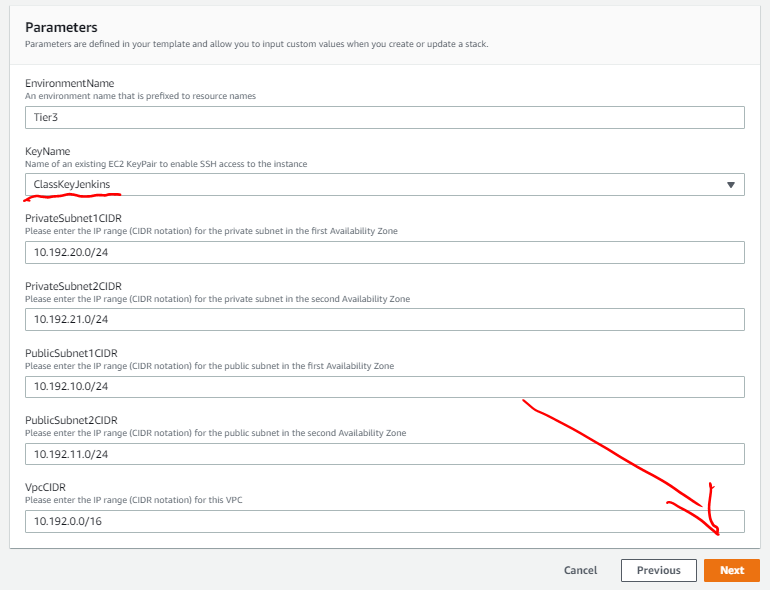

  After hitting **next**, wait for a couple minutes in order for the stack to finish creating the resources.
  
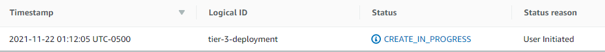

Once the stack is created, proceed to the next task.

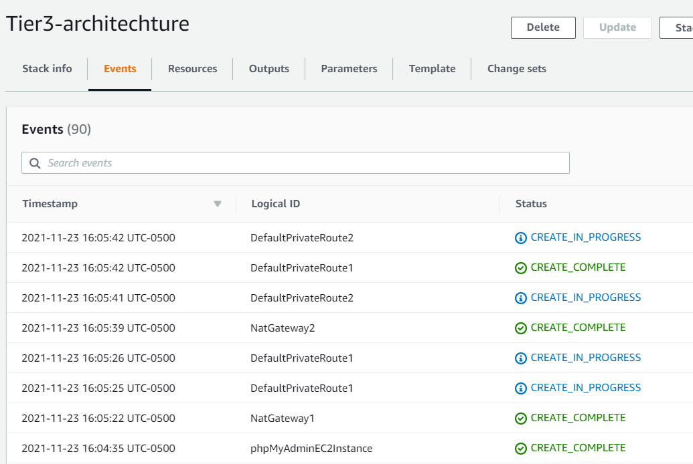

8. All the resources: phpmyadmin EC2 and Web proxy for caching will be created by the template base.yaml, and it’s secure.
9. After creating all the resources, **ssh** into the three **EC2** instances:
  * First, **ssh** into the **Bastion** EC2:
  
  * Follow the screenshots in order to find the command used to ssh.
  
   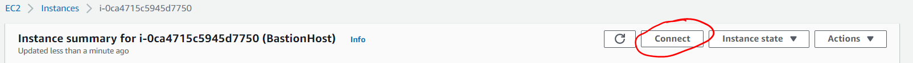
   
   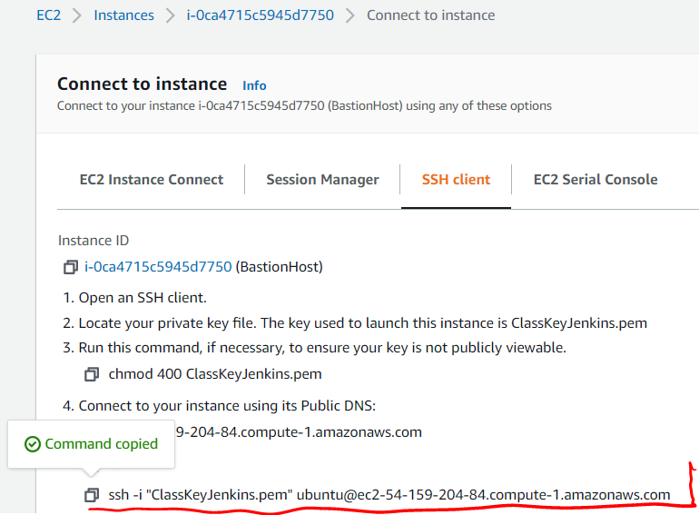
   
   * Copy the command above and paste it into the command line interface.

   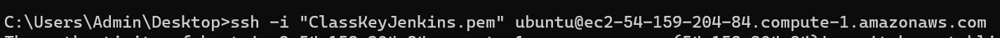
    
   * Now, run the commands ```sudo apt-get update -y``` and ```sudo apt-get upgrade -y```. This will update and upgrade the dependencies needed. And the ```-y``` will take ```yes``` as a default.
   
   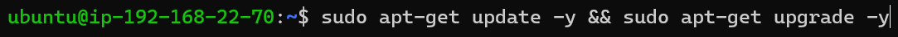
   
   * Don't forget to add the ```key_pair_name.pem``` into the **Bastion** host before you ssh to the other instances from it. Also, make the ```key_pair_name.pem``` not available to the public by running the command ```sudo chmod 400 key_pair_name.pem```.
   
   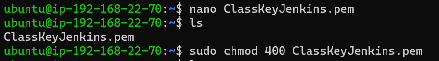
   
   * Now, from the **Bastion EC2**, **ssh** into the **NGINX EC2** instances to make sure it works. Use the same methods as for the first EC2.
   * Once the ```update``` and ```upgrade``` is done, **exit** from the **NGINX** and **ssh** into the **phpMyAdmin** from the **Bastion** host, and, ```update``` and ```upgrade``` as well.
   
### Task 2:

1. Create a target goup

First, go to ```EC2 > Target groups > Create target groups```.

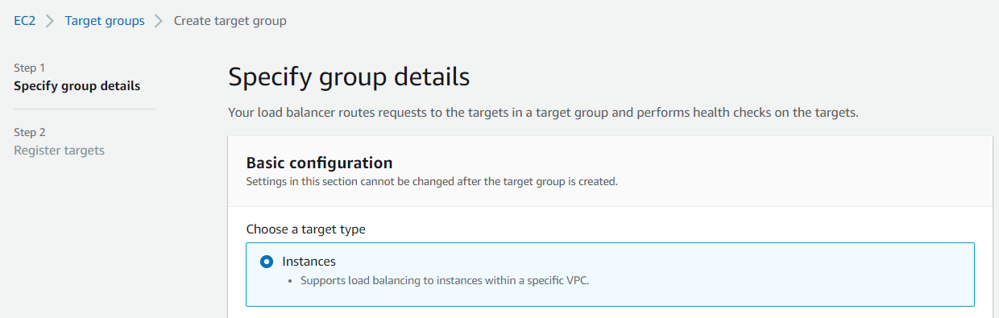

Then, choose the **VPC** and port **80**. with **HTTP/HTTP1** protocols

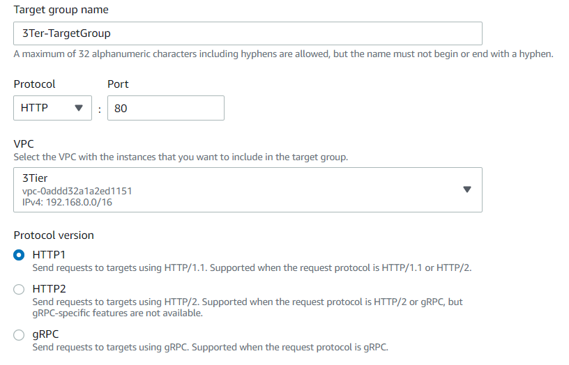

Register the **NginxProxy** to the target group and click on ```include as pending bellow``` with **port 80**.

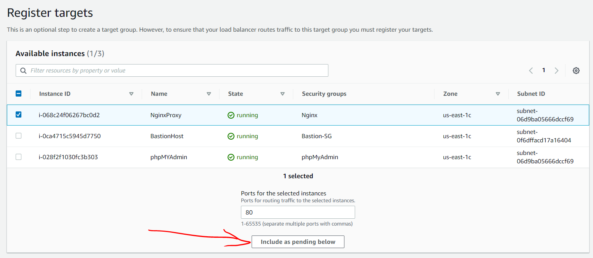

Now, create the target group.

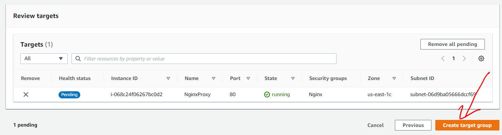

2. Create an AWS load balancer to connect to the reverse proxy.
* 
### Task 3:

* Create a MySQL database on AWS by first creating a subnet group
* Select your vpc and subnets
* 
### Task 4:


## Sources:

1. https://jennapederson.com/blog/2021/6/21/provisioning-an-ec2-instance-with-cloudformation-part-1/
2. https://rdspg-monitoring.workshop.aws/en/prep/env/own-account.html
3. https://dev.classmethod.jp/articles/cloudformation-template-for-creating-ec2-with-load-balancer/
4. https://medium.com/the-andela-way/designing-a-three-tier-architecture-in-aws-e5c24671f124
